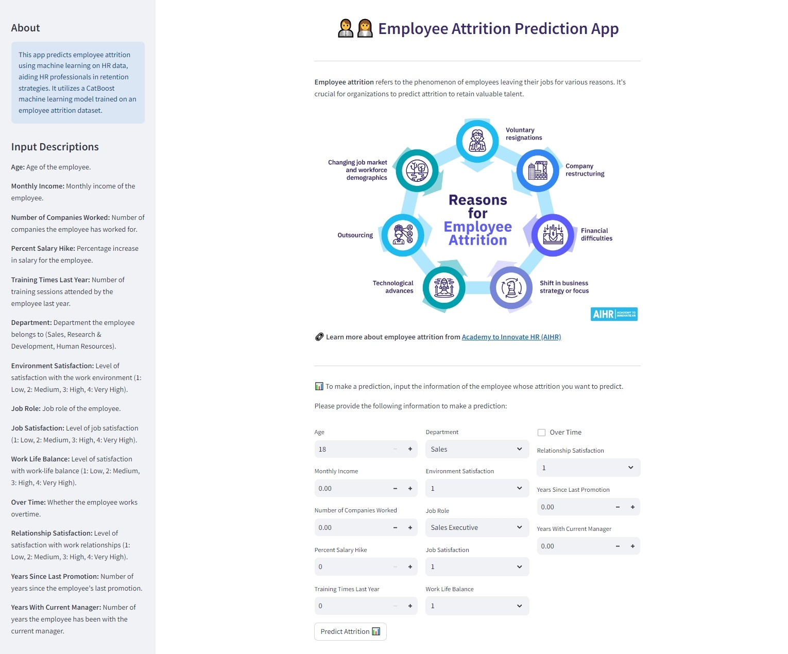
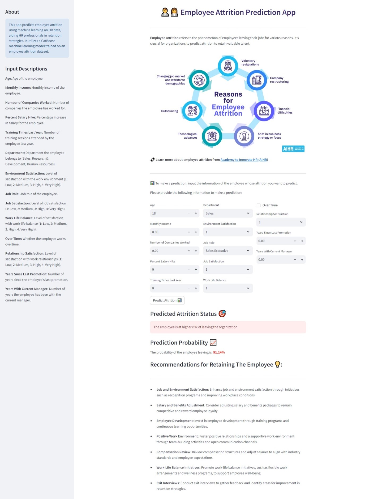

# Employee-Attrition-Prediction Project
The goal of this project is to analyze employee retention data to uncover insights that can help improve retention strategies. By identifying key factors that influence employee attrition, we aim to provide actionable recommendations for enhancing employee satisfaction and retention rates.

<p align="center">
  
</p>

## Summary
|     Jupyter Notebook                       |     Power BI Dashboard|     Published Article|    Deployed App on Hugging Face     
| -------------                  | -------------    | -------------    |    -----------------    
|[Notebook with analysis and model development](https://github.com/rasmodev/Employee-Attrition-Prediction/blob/main/notebooks/Employee_Attrition.ipynb)|  [Interactive Dashboard](https://app.powerbi.com/view?r=eyJrIjoiMzFjZTk5NTctMWNkMS00ZTIzLWI4ZGYtYjEzZGU1MjAyOGFiIiwidCI6IjQ0ODdiNTJmLWYxMTgtNDgzMC1iNDlkLTNjMjk4Y2I3MTA3NSJ9) |  [Published Article on Medium]() |[Link to Deployed Streamlit App](https://rasmodev-employee-attrition-prediction-app.hf.space)

## App Interface
After clicking on the link to the working APP, provide the required details, and click on the **"PREDICT"** button.

### Before Prediction



### After Prediction


## Dataset

The dataset contains various attributes related to employee demographics, work-life balance, compensation, and training. Key features include:

- **Age**: Employee's age group
- **Work-Life Balance**: Measure of work-life balance (1 to 4)
- **Monthly Salary**: Employee's average monthly salary
- **Gender**: Employee's gender
- **Training Sessions**: Number of training sessions attended in the previous year
- **Job Level**: Entry-level, Mid-level, or Senior-level
- **Attrition**: Indicator of whether the employee left the organization

## Analysis and Insights

### Key Findings

1. **Age and Attrition**
   - Employees in the younger age group (26 to 35 years) are more prone to attrition.

2. **Work-Life Balance**
   - 65% of employees enjoy good work-life balance, while 35% experience poor work-life balance.

3. **Monthly Salary and Attrition**
   - The average monthly salary significantly impacts employee attrition, with departing employees earning an average of $4,787 compared to $6,833 for those who remain.
   - Gender-specific average monthly income does not affect attrition rates, as both male and female departing employees have similar salary ranges.

4. **Training and Attrition**
   - Entry-level employees who left the organization did not receive adequate training, with 97% receiving less than 5 training sessions in the previous year.

### Recommendations

1. **Targeted Retention for Younger Employees**
   - Implement mentorship programs and career development initiatives tailored to engage and retain employees within the 26 to 35 age group.
   - Invest in orientation programs and career development initiatives specifically tailored to entry-level staff to enhance their skills, job satisfaction, and retention.

2. **Work-Life Balance Initiatives**
   - Prioritize work-life balance initiatives to improve the well-being and retention of employees, especially those facing challenges in this area.

3. **Review Compensation Packages**
   - Ensure compensation and benefits packages are competitive in the market. Adjust salaries to align with industry standards to increase retention.
   - Focus on retention strategies unrelated to gender-specific compensation, such as career development opportunities and work environment improvements.

4. **Enhanced Training Programs**
   - Invest in orientation programs and career development initiatives specifically tailored to entry-level staff to enhance their skills, job satisfaction, and retention.

## Files in the Repository

- **data/employee_data.csv**: The dataset used for analysis.
- **notebooks/data_analysis.ipynb**: Jupyter notebook containing the data analysis and visualization.
- **reports/insights_and_recommendations.pdf**: Detailed report of the findings and recommendations.
- **scripts/data_preprocessing.py**: Script for data preprocessing and cleaning.
- **scripts/visualization.py**: Script for generating visualizations.

## Getting Started

To get started with the project, follow these steps:

1. Clone the repository:
   ```bash
   git clone https://github.com/username/employee-retention-analysis.git
   ```
2. Navigate to the project directory:
   ```bash
   cd employee-retention-analysis
   ```
3. Install the required dependencies:
   ```bash
   pip install -r requirements.txt
   ```
4. Run the data preprocessing script:
   ```bash
   python scripts/data_preprocessing.py
   ```
5. Open the Jupyter notebook to explore the analysis:
   ```bash
   jupyter notebook notebooks/data_analysis.ipynb
   ```

## Dependencies

- pandas
- numpy
- matplotlib
- seaborn
- jupyter
- scikit-learn

## Contributing

Contributions to this project are welcome. If you have any suggestions or improvements, please open an issue or submit a pull request.

## License

This project is licensed under the MIT License. See the [LICENSE](LICENSE) file for more details.

## Author

`Rasmo Wanyama`

`Data Analyst/Data Scientist`

Let's connect on LinkedIn:

[](https://www.linkedin.com/in/rasmo-/) 

---

Thank you for your interest in the Employee Retention Analysis Project! I hope our findings and recommendations help you improve employee retention and satisfaction within your organization.
